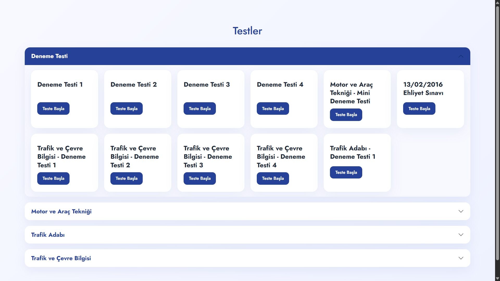
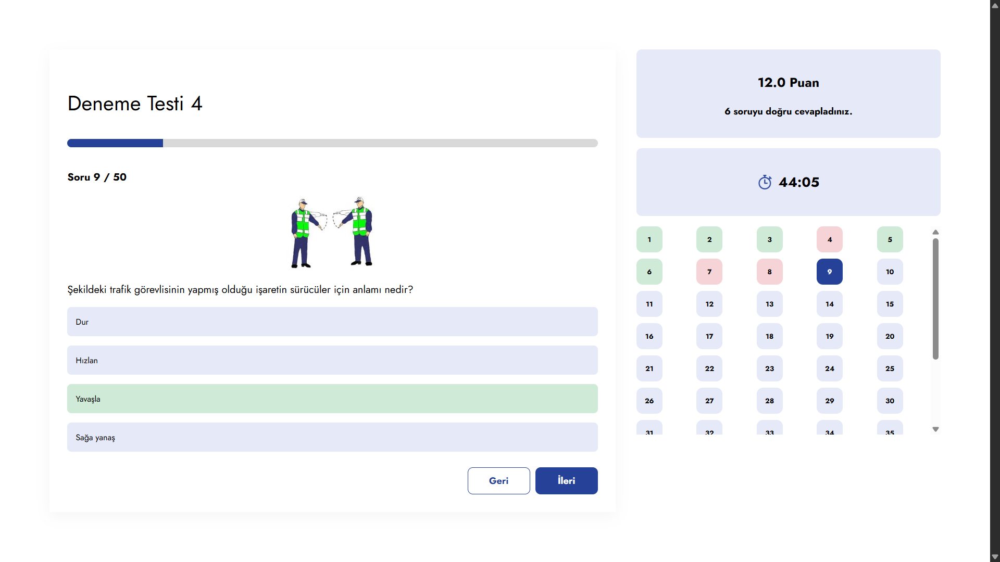
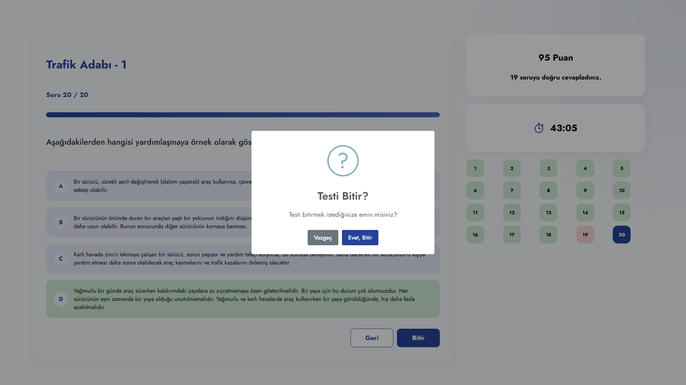
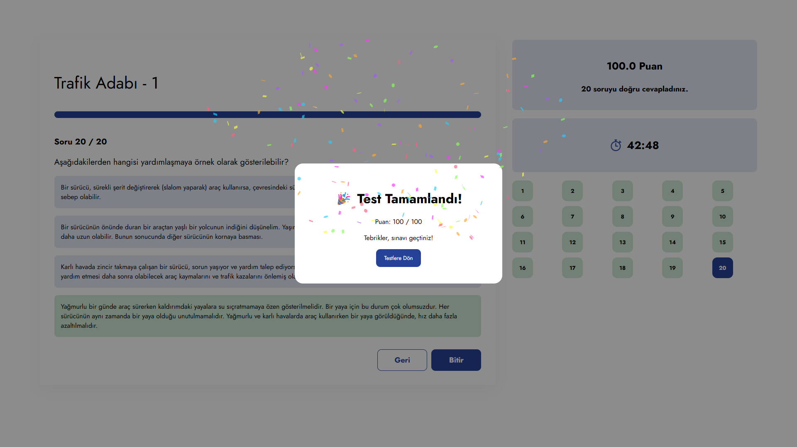
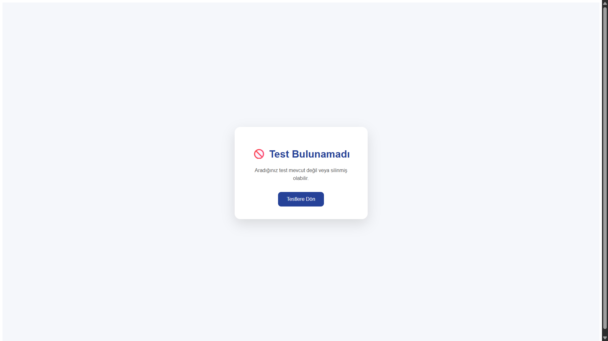

# 🚗 Driving School Quiz App

A web-based driving school quiz application developed using **PHP** and **MySQL**. The application enables users to take category-based driving tests through a modern, responsive, and user-friendly interface.

---

## ✨ Features

- 📚 Category-based quiz listing
- 📝 Online multiple-choice exams
- 📊 Progress indicator during the exam
- ✅ Instant answer feedback
- 🏁 Final score screen
- ⚠️ Error handling for invalid test requests
- 📱 Responsive design
- 🔒 Secure database queries using Prepared Statements
- 🛡️ XSS protection with `htmlspecialchars()`

---

## 🛠️ Technologies

- PHP
- MySQL
- HTML5
- CSS3
- Bootstrap 5
- JavaScript
- SweetAlert2

---
## 📸 Screenshots

### 🏠 Home Page



---

### 📝 Quiz Page



---

### 🏁 Quiz Completed




---

### ❌ Error Page


---

## ⚙️ Installation

1. Clone the repository.

```bash
git clone https://github.com/esraiclald/driving-school-quiz-app.git
```

2. Move the project folder into your web server directory (e.g. `htdocs`).

3. Import the provided MySQL database.

4. Update the database credentials in `conn.php`.

5. Start **Apache** and **MySQL**.

6. Open your browser and visit:

```
http://localhost/driving-school-quiz-app
```

---

## 📂 Project Structure

```
DrivingSchoolQuizApp/
│
├── css/
├── uploads/
├── index.php
├── test.php
├── conn.php
├── error.php
└── README.md
```

---

## 🚀 Future Improvements

- 👤 User authentication
- 🛠️ Admin panel
- 📚 Question management system
- ⏱️ Exam timer
- 🔀 Randomized questions
- 📈 Exam history and statistics

---

## 👩‍💻 Author

Developed by **İclal**.
